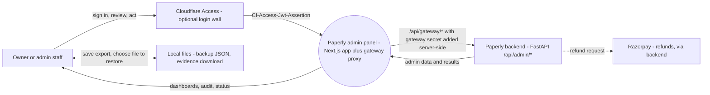
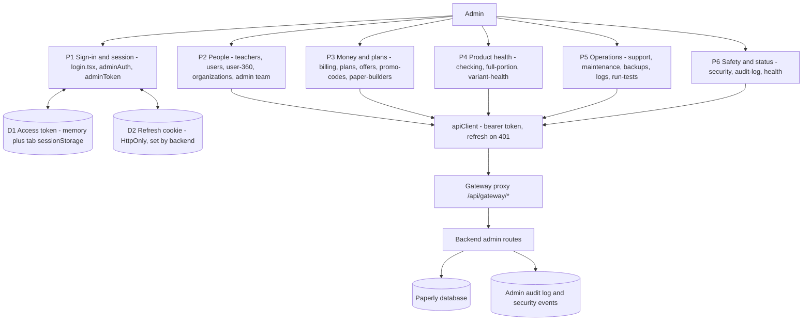
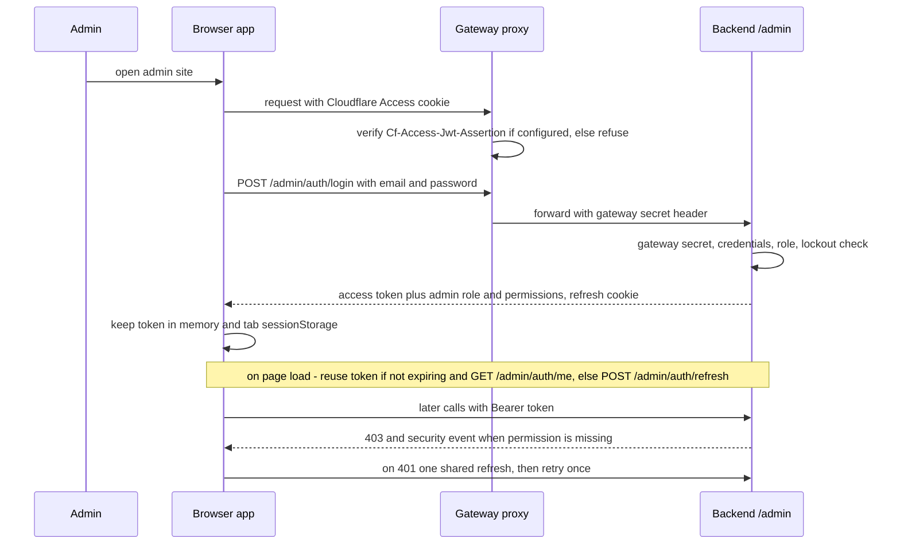
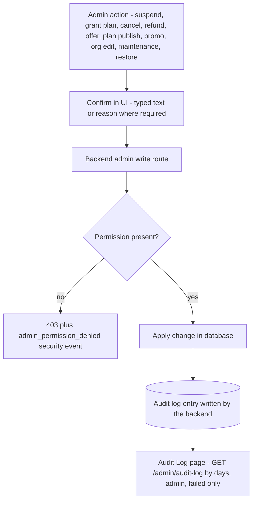
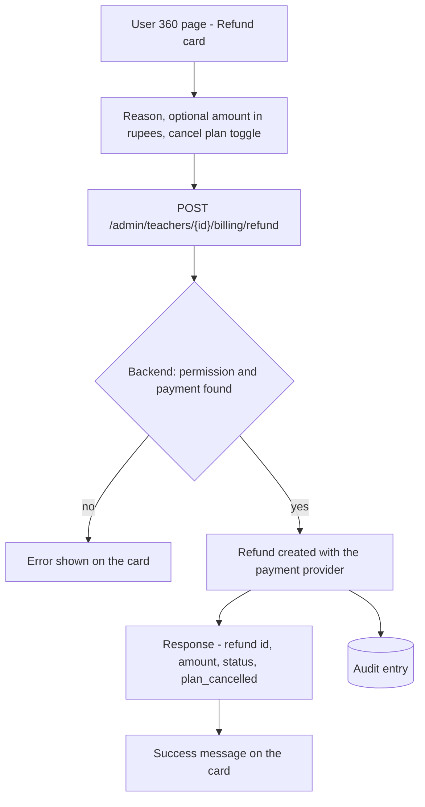
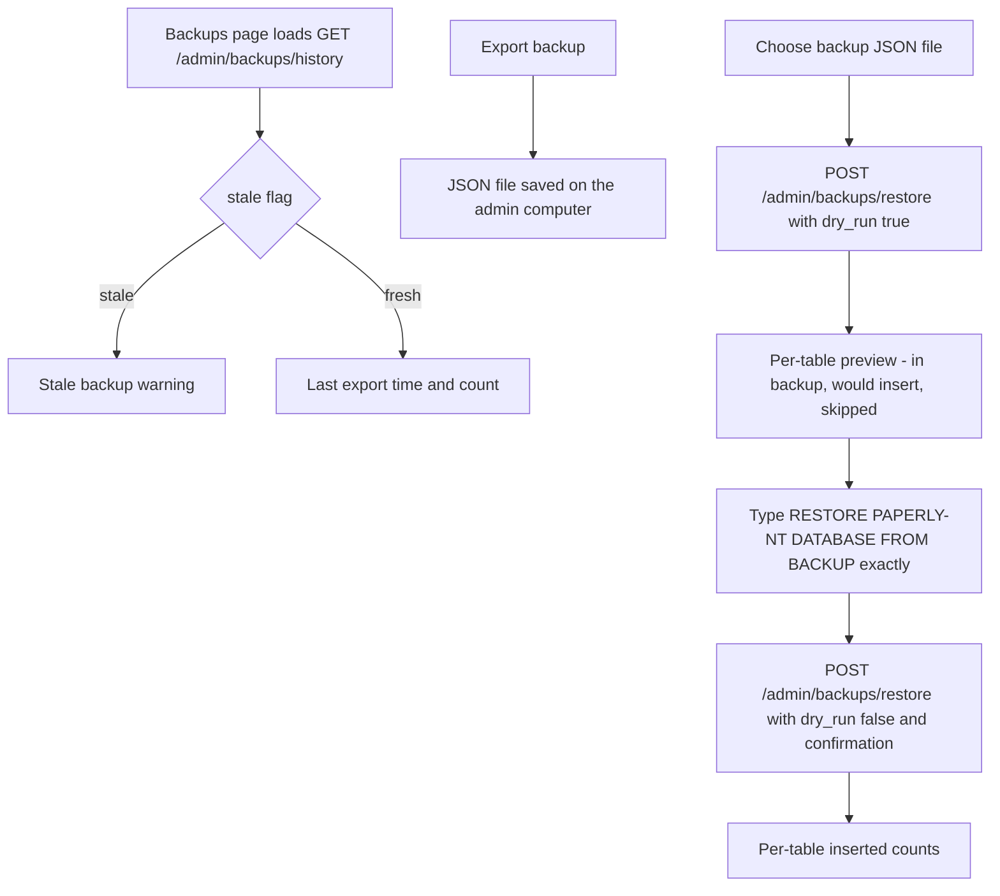
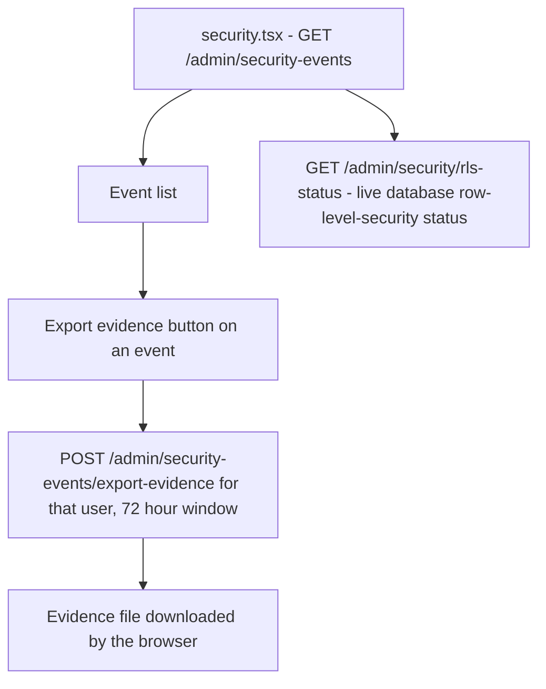
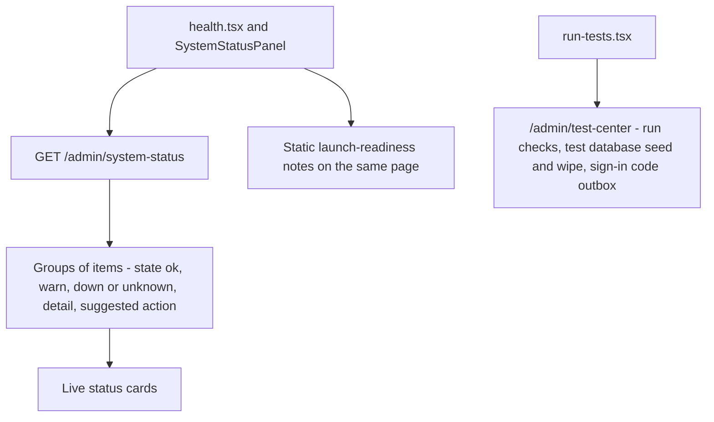

# Paperly Admin Panel DFDs

## Current state (2026-10-03)

Status: DONE for Levels 0, 1 and 2 below; checked against `src/pages`, `src/lib`, `src/components` and `src/pages/api/gateway/[...path].ts`. Permission decisions, automatic audit of write routes, login lockout and the strict API CSP are backend behaviour in `paperly-mvp` and are NOT CHECKABLE from this repo; the diagrams show them as the boundary this panel calls.

Rule: admin sessions and actions stay isolated from teacher sessions (admin tokens carry audience `paperly-admin`). The panel monitors and controls the platform; it does not own template ingestion or teacher paper building.

### Level 0 - context

- The browser only talks to the admin site. The server route `src/pages/api/gateway/[...path].ts` verifies the Cloudflare Access token when `CF_ACCESS_TEAM_DOMAIN` and `CF_ACCESS_AUD` are set, adds the gateway secret header from a server-only variable, strips client-sent `x-ztna-*`, `cf-*` and forwarded headers, and forwards to `ADMIN_BACKEND_URL`. Setup is in `docs/admin-gateway-setup.md`.
- Refunds reach Razorpay through the backend only; this panel never talks to Razorpay (the backend side is NOT CHECKABLE here).

### Level 1 - processes and data stores

Pages in `src/pages` and the sections in the sidebar (`AppShell.tsx`): Overview, Users, User 360, Organizations, Admin Team, Billing, Plans and Features, Offers, Promo Codes, Paper Builders, AI Checking, Variant Health, Support, Maintenance, Backups, Health, Server Logs, Run Tests, Security, Audit Log. Write controls are hidden or disabled by `hasPermission(...)` where the page checks it (for example `organizations.write`, `billing.write`, `users.write`); the backend remains the authority.

### Level 2 - key flows

#### 2.1 Gateway sign-in, session and permissions

The login form shows backend error text only when it is plain text; HTML or traceback bodies fall back to a generic message.

#### 2.2 Audited admin writes

The panel reads the audit trail (`audit-log.tsx`); that every write route is audited automatically is backend behaviour and NOT CHECKABLE from this repo.

#### 2.3 Refund

#### 2.4 Backup and restore

Not built, as stated on `health.tsx`: two-factor sign-in and re-asking for the password before backups, restores and maintenance. Maintenance writes use a typed confirmation as well.

#### 2.5 Security events and evidence

#### 2.6 System status

### Diagram files

The inline diagrams above are the current reference. Files kept in this folder:

- `admin-control-panel-level1-flow.mmd` - OLDER Level 1 view (2026-08): lists seven sections only and predates audit log, health, run tests, plans, offers, organizations and the gateway proxy. Superseded by Level 1 above.
- `admin-security-rbac-level2-flow.mmd` - still accurate for token validation, role permission gating and denied-attempt logging; the "step-up auth recommended" branch is not built. See 2.1.
- `admin-panel-feature-coverage-gap-2026-09-05.mmd` - HISTORICAL and obsolete: every gap it listed is closed except template-lifecycle write routes (edit, replace, delete), which still have no caller in this repo (OPEN).

## History

Dated update entries that used to live here are in `docs/project-history.md`.

## Lesson: shared endpoints and per-row work

`health.tsx` calls `GET /templates`, which once ran the full question generator per template on every call (15-38 s for 36 templates, about 1 s after the work became opt-in in the backend). If a list endpoint's time grows with row count, look for hidden per-row work and make expensive expansions opt-in.

## Open items

- OPEN: template-lifecycle write routes (edit, replace, delete) have no caller in this repo.
- OPEN: a Full Portion plan control, if added, must use `max_full_portion_topics` (the subtopic cap was removed).
